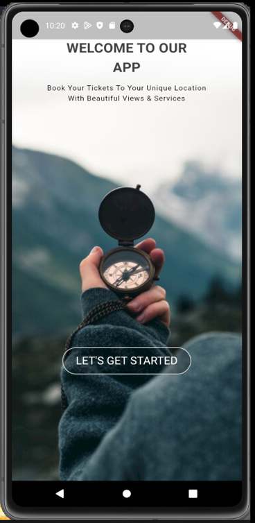

<p align="center"><a href="https://androidstudio.com" target="_blank"></a></p>

# Travel App

## Quick Start 
clone the repo
```
    git clone https://github.com/HayderLabidi/Travel_app.git
```


# That's all 🎊🎉 

## ScreenShots
<br /> <br />
<br /> <br />
<br /> <br />
<br /> <br />
<br /> <br />
<br /> <br />
<br /> <br />
<br /> <br />
<br /> <br />


```
Make sure to leave a start ✨✨
```

